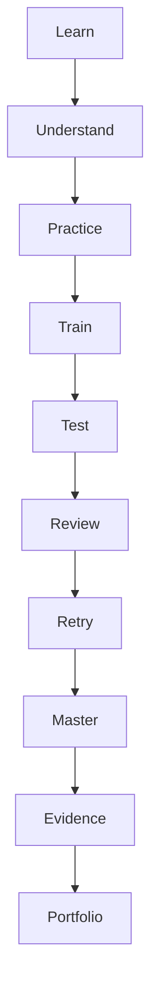
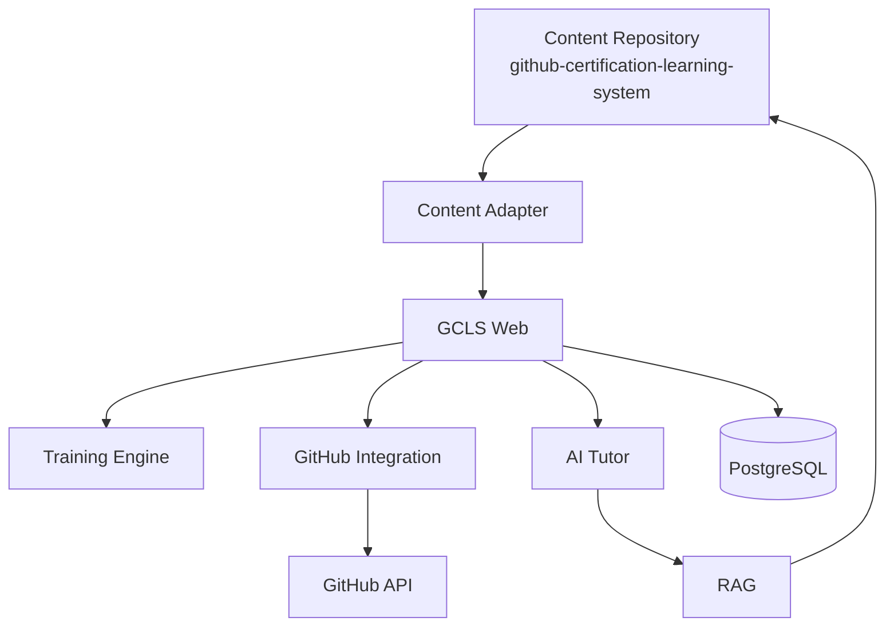

# 010 시스템 개요 (System Overview, SO)

## 빠른 시작 (Quick Start, QS)

- 콘텐츠 원본은 메인 GCLS Repository입니다.
- Web은 사용자 상태와 학습 경험을 담당합니다.
- 최초 완성 범위는 GH-900 Vertical Slice입니다.

## 목차 (Table of Contents, TOC)

1. 목적
2. 시스템 경계
3. 핵심 모듈
4. 데이터 소유권
5. 최초 Vertical Slice

## 1. 목적

GCLS Web은 읽기 전용 문서 사이트가 아니라 다음 순환을 실행하는 학습 플랫폼입니다.



## 2. 시스템 경계



## 3. 핵심 모듈

- Learning
- Training
- Question Bank
- Wrong Answers / Spaced Review
- Mock Exam / Exam Readiness Gate
- Labs
- AI Gateway / AI Tutor
- RAG
- GitHub Verification
- Progress
- Evidence
- Portfolio

초기 배포는 **Modular Monolith**로 구성하고 모듈 경계를 코드 수준에서 유지합니다.

## 4. 데이터 소유권

| 데이터 | Source of Truth |
|---|---|
| 과정/용어/개념/가이드/문제/실습 콘텐츠 | GCLS Content Repository |
| 사용자 | Web Database |
| 학습 세션/시도/점수/오답 | Web Database |
| GitHub 실습 검증 결과 | Web Database + GitHub 원격 객체 |
| AI 대화/평가 로그 | Web Database — 저장 정책 적용 |
| Evidence/Portfolio 메타데이터 | Web Database |

## 5. 최초 Vertical Slice

GH-900에서 다음 흐름을 끝까지 먼저 완성합니다.

```text
Content → Lesson → Question → Attempt → Wrong Answer
→ Mock → Readiness → Lab → GitHub Verification → Evidence
```

이 Vertical Slice가 안정화된 뒤 002~006 과정으로 확장합니다.
