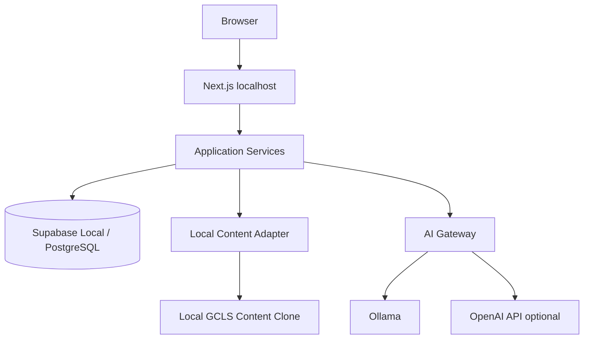

# 020 로컬 아키텍처 (Local Architecture, LA)

## 빠른 시작 (Quick Start, QS)

1단계 목표는 **외부 Cloud 배포 없이 핵심 기능을 개발·테스트할 수 있는 환경**입니다. 외부 AI API는 선택적으로 사용합니다.

## 목차 (Table of Contents, TOC)

1. 1단계 원칙
2. 권장 스택
3. 실행 구조
4. 로컬 콘텐츠 연결
5. 환경변수 기준
6. P1 완료 기준

## 1. 1단계 원칙

- Web/App/DB/Auth/Storage/AI 연동을 로컬에서 재현합니다.
- Supabase Local은 Postgres/Auth/Storage의 개발 플랫폼으로 사용합니다.
- Ollama를 기본 Local AI provider로 사용합니다.
- OpenAI API는 선택적 Cloud AI provider로 연결합니다.
- 콘텐츠는 로컬 clone의 메인 GCLS Repository를 우선 읽습니다.

## 2. 권장 스택

| 영역 | 기술 |
|---|---|
| Web | Next.js + TypeScript |
| UI | Tailwind CSS + shadcn/ui |
| DB/Auth/Storage | Supabase Local |
| Database | PostgreSQL |
| Vector | PostgreSQL vector extension |
| Local AI | Ollama |
| Local AI GUI | LM Studio optional |
| External AI | OpenAI API optional |
| Test | Vitest + Playwright |
| Runtime | Docker-compatible local runtime |

## 3. 실행 구조



## 4. 로컬 콘텐츠 연결

권장 개발 디렉터리 예시:

```text
workspace/
├── github-certification-learning-system/
└── github-certification-learning-system-web/
```

Web은 환경변수로 콘텐츠 경로를 받습니다.

```text
GCLS_CONTENT_PROVIDER=local
GCLS_CONTENT_DIR=../github-certification-learning-system
```

## 5. 환경변수 기준

API 키는 Client Component 또는 브라우저 번들에 포함하지 않습니다.

```text
AI_MODE=hybrid
LOCAL_AI_PROVIDER=ollama
LOCAL_AI_BASE_URL=http://localhost:11434
CLOUD_AI_PROVIDER=openai
OPENAI_API_KEY=<server-side-secret>
```

## 6. P1 완료 기준

- Next.js 실행 PASS
- Supabase Local 실행 PASS
- DB migration PASS
- Seed PASS
- Local content path health check PASS
- Ollama health check PASS 또는 명시적 optional 상태
- OpenAI key 없이도 기본 개발 가능
- Unit/Integration/E2E 최소 smoke test PASS
