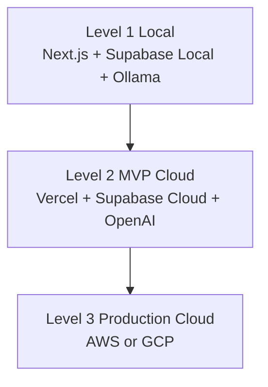

# 030 클라우드 성장 경로 (Cloud Evolution, CE)

## 빠른 시작 (Quick Start, QS)

애플리케이션 코드는 최대한 유지하고 **Infrastructure Adapter와 배포 대상만 교체**하는 것이 목표입니다.

## 목차 (Table of Contents, TOC)

1. 3단계 모델
2. 단계별 매핑
3. Portability 규칙
4. AWS/GCP 선택 시점

## 1. 3단계 모델

## 2. 단계별 매핑

| Capability | Level 1 | Level 2 | Level 3 AWS | Level 3 GCP |
|---|---|---|---|---|
| App | Local Next.js | Vercel | ECS/EKS 등 | Cloud Run/GKE 등 |
| PostgreSQL | Supabase Local | Supabase Cloud | RDS | Cloud SQL |
| Object Storage | Local Supabase Storage | Supabase Storage | S3 | Cloud Storage |
| Cache | Optional local Redis | Managed optional | ElastiCache | Memorystore |
| Queue | In-process/optional | Managed optional | SQS | Pub/Sub |
| AI | Ollama/OpenAI | OpenAI + managed options | API + self-hosted | API + Vertex/self-hosted |

구체 서비스는 3단계 진입 시점의 요구량·비용·보안·조직 역량을 기준으로 재평가합니다.

## 3. Portability 규칙

- PostgreSQL 표준을 유지합니다.
- Storage/Auth/AI/Content/GitHub는 Adapter를 통해 접근합니다.
- 환경별 설정은 환경변수와 Secret Manager 계층으로 분리합니다.
- Domain/Application 계층에서 특정 Cloud SDK 직접 호출을 금지합니다.
- Migration과 Seed를 코드 저장소에서 버전 관리합니다.

## 4. AWS/GCP 선택 시점

P0에서 AWS/GCP를 확정하지 않습니다. 다음 정보가 확보된 후 결정합니다.

- 동시 사용자 수
- AI 호출량/GPU 필요량
- Sandbox 수요
- 교육기관/기업 보안 요구사항
- 데이터 분석 요구사항
- 국내/글로벌 운영 지역
- 예상 월 인프라 비용
