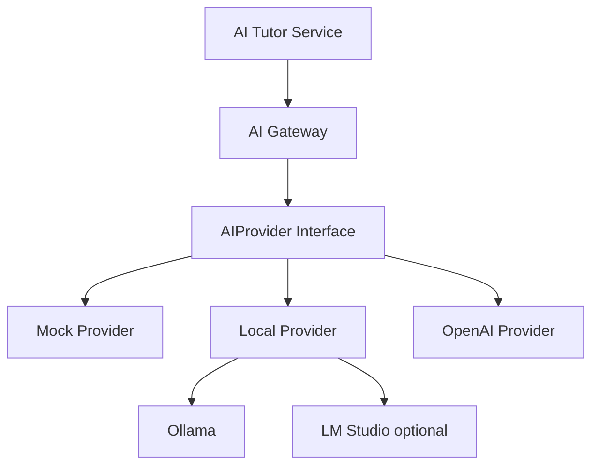

# 040 AI 아키텍처 (AI Architecture, AIA)

## 빠른 시작 (Quick Start, QS)

AI는 한 공급자에 직접 결합하지 않습니다. `Mock / Local / API / Hybrid` 4개 실행 모드를 공통 인터페이스로 지원합니다.

## 목차 (Table of Contents, TOC)

1. AI Mode
2. Provider 경계
3. Local First 정책
4. 학습용 AI 역할
5. 안전·비용·관측성

## 1. AI Mode

| Mode | 목적 |
|---|---|
| `mock` | UI/Test/CI에서 결정론적 응답 |
| `local` | Ollama/LM Studio 등 로컬 모델 사용 |
| `api` | OpenAI 등 외부 API 사용 |
| `hybrid` | Local 우선 + Cloud fallback |

## 2. Provider 경계



개념 인터페이스:

```ts
interface AIProvider {
  generate(request: AIRequest): Promise<AIResponse>;
  embed?(texts: string[]): Promise<number[][]>;
  healthCheck(): Promise<boolean>;
}
```

## 3. Local First 정책

기본 Hybrid Routing:

```text
요청
→ Local Provider 시도
→ 성공/정책 허용/품질 기준 충족: 반환
→ 실패 또는 Cloud-required task: Cloud Provider
```

초기에는 복잡한 confidence score보다 **명시적 task policy + 실패 fallback**을 우선합니다.

## 4. 학습용 AI 역할

AI Tutor는 정답 생성기가 아니라 학습 코치로 동작합니다.

```text
Hint → Retry → Concept → Retry → Example → Retry → Explanation → Remediation
```

주요 task:

- 용어 쉬운 설명
- 단계별 힌트
- 오답 원인 분류 보조
- 관련 개념 연결
- 유사 훈련 생성
- 학습 세션 요약
- RAG 기반 출처 제시

정답/점수의 공식 판정이 가능한 항목은 가능한 한 **결정론적 Rule Engine**을 우선하고 AI 판정만으로 PASS를 확정하지 않습니다.

## 5. 안전·비용·관측성

각 AI 요청은 최소 다음 메타데이터를 기록할 수 있어야 합니다.

- provider / model
- task type
- latency
- token/usage 또는 local inference metric
- fallback 여부
- RAG source ids
- 오류 코드

사용자 비밀정보·API 키·민감정보를 prompt log에 저장하지 않습니다.
