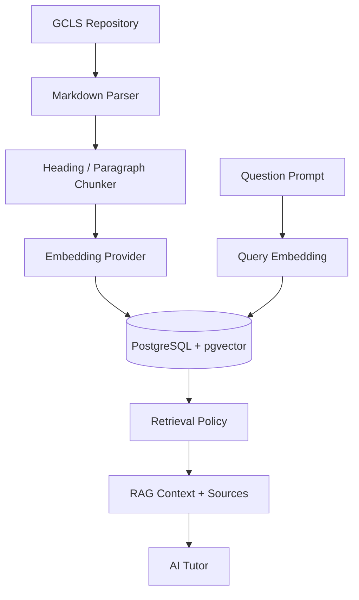

# 050 RAG 아키텍처 (Retrieval-Augmented Generation Architecture, RAGA)

## 빠른 시작 (Quick Start, QS)

P8에서 RAG는 **GCLS 콘텐츠 Repository를 대체하지 않고 검색용 파생 Index만 생성**하도록 구현했습니다. GH-900 Vertical Slice는 PostgreSQL `pgvector`와 384차원 Embedding을 사용합니다.

## 목차 (Table of Contents, TOC)

1. Pipeline
2. Source of Truth 경계
3. Chunk / Embedding
4. Retrieval Policy
5. Freshness / Profile
6. Security
7. 확장 방향

## 1. Pipeline



## 2. Source of Truth 경계

```text
GitHub Content Repository = Source of Truth
PostgreSQL RAG Index      = Regenerable Derivative
```

`rag_documents`에는 원문 위치, Hash, Version, Profile metadata를 저장하고 `rag_chunks`에는 검색 가능한 Chunk와 Vector를 저장합니다. 콘텐츠를 수정할 때 DB를 직접 편집하지 않습니다.

## 3. Chunk / Embedding

Markdown을 Heading과 Paragraph 경계로 분할하며 기본 Chunk 목표 크기는 약 1,400자입니다.

Embedding Provider:

- Mock — 결정론적 CI
- Ollama — `/api/embed`
- OpenAI — `/v1/embeddings`

P8 Schema는 `extensions.vector(384)`입니다.

생성 AI의 `hybrid`와 달리 Embedding은 하나의 Index에서 Provider를 섞지 않습니다. `embedding_profile = provider:model:dimensions`를 저장하여 Query 시 동일성을 강제합니다.

## 4. Retrieval Policy

P8는 Retrieval Source를 두 단계로 나눕니다.

```text
PRE_ANSWER
Overview / Terms / Concepts / Official Docs / Guides / Labs / Resources

POST_ATTEMPT
Exercises / Final Review / Projects
```

`Question Bank / Mock Exams / Wrong Answers`는 Index에서 제외합니다.

- Hint / Concept / Similar Example → PRE_ANSWER만
- Explanation → 실제 Attempt 후 PRE_ANSWER + POST_ATTEMPT
- Public Search API → 항상 PRE_ANSWER만

이 정책은 UI가 아니라 Server에서 강제합니다.

## 5. Freshness / Profile

- `content_hash`: 문서 SHA-256
- `source_ref`: `GCLS_CONTENT_VERSION`
- `embedding_profile`: Provider + Model + Dimension

Hash가 동일하면 재색인을 Skip하고, 변경 문서만 다시 Chunk/Embedding합니다. Profile 변경 시 대상 문서를 새 Vector Space로 재색인합니다.

Search 시:

- Index 없음 → `RAG_INDEX_NOT_READY`
- Source Version 불일치 → `RAG_INDEX_STALE`
- Embedding Profile 불일치 → `RAG_PROFILE_MISMATCH`

`RAG_GROUNDING_MODE=required`에서는 위 상태나 검색 근거 부족 시 AI 생성도 차단합니다.

## 6. Security

- RAG index tables: service-role only
- Index API: `RAG_INDEX_TOKEN` 필요
- Search API: authenticated user 필요
- Search API: PRE_ANSWER only
- `ai_interaction_sources`: 사용자 자신의 Source Audit만 SELECT
- API Key / RAG token / service-role credential은 server-only
- AI는 채점하지 않음

## 7. 확장 방향

P8에서는 정확성·검증 가능성을 먼저 확보하기 위해 10개 GH-900 문서를 exact cosine search로 조회합니다. Corpus가 커지는 002~006 확장 단계에서 Query latency를 측정한 뒤 HNSW/IVFFlat, Reranker, Hybrid lexical+vector search를 추가합니다.

즉 Approximate Index를 선제적으로 도입하지 않고 실제 Corpus 규모와 측정값을 기준으로 확장합니다.
