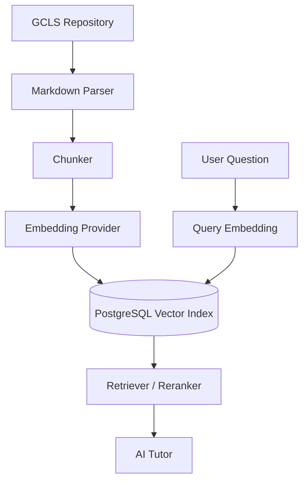

# 050 RAG 아키텍처 (Retrieval-Augmented Generation Architecture, RAGA)

## 빠른 시작 (Quick Start, QS)

AI Tutor는 GCLS 메인 콘텐츠를 검색한 뒤 답변하도록 설계합니다. RAG는 콘텐츠 Repository를 대체하지 않고 **검색 인덱스**만 생성합니다.

## 목차 (Table of Contents, TOC)

1. Pipeline
2. Metadata
3. Index 정책
4. Retrieval 정책
5. Freshness

## 1. Pipeline



## 2. Metadata

각 chunk는 최소 다음 정보를 가집니다.

- repository
- commit sha / content version
- course code
- document path
- section heading
- content type: terms/concepts/official-docs/lab/question/etc.
- source URL 또는 repository path
- indexed_at

## 3. Index 정책

- Markdown 원문 전체를 DB Source of Truth로 취급하지 않습니다.
- Chunk는 재생성 가능한 파생 데이터입니다.
- Hash가 바뀐 문서만 재색인할 수 있도록 설계합니다.
- 문제 정답처럼 노출 제한이 필요한 콘텐츠는 retrieval policy로 분리합니다.

## 4. Retrieval 정책

우선순위 예시:

```text
현재 과정 콘텐츠
→ 관련 공식 문서 요약
→ 관련 Lab/Exercise
→ 교차 과정 개념
```

시험형 질문에서는 정답 누설을 피하기 위해 Training State에 따라 retrieval 결과를 제한할 수 있어야 합니다.

## 5. Freshness

콘텐츠 Repository commit SHA를 RAG index version에 기록합니다. 메인 콘텐츠가 변경되면 index drift를 감지하고 재색인 Queue에 넣습니다.
