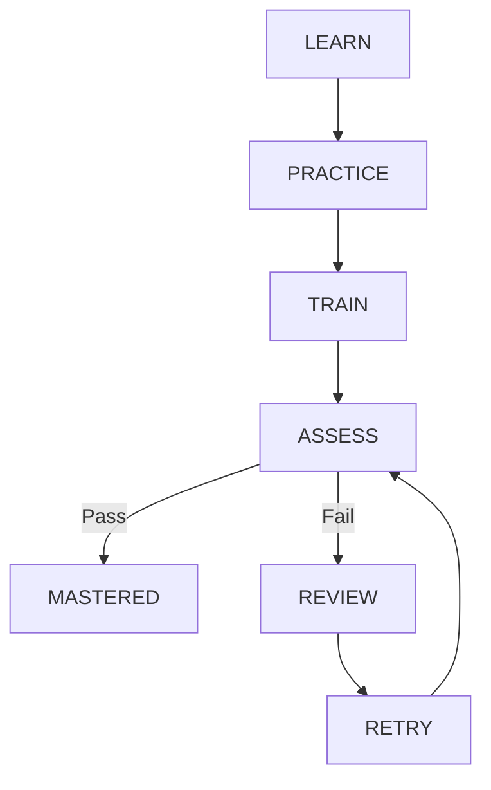

# 060 훈련 엔진 (Training Engine, TE)

## 빠른 시작 (Quick Start, QS)

Training Engine은 `학습 → 연습 → 반복 → 평가 → 재시도 → 숙달` 상태를 관리하는 핵심 Domain입니다.

## 목차 (Table of Contents, TOC)

1. 10단계 Training Level
2. 상태 흐름
3. 오답/재학습
4. AI와 Rule Engine의 역할
5. 완료 기준

## 1. 10단계 Training Level

| Level | 훈련 형태 |
|---:|---|
| 01 | 설명 읽기 |
| 02 | 예제 따라하기 |
| 03 | 힌트 포함 수행 |
| 04 | 빈칸 수행 |
| 05 | 명령/행동 선택 |
| 06 | 오류 수정 |
| 07 | 상황형 문제 |
| 08 | 시간 제한 수행 |
| 09 | 무힌트 수행 |
| 10 | 실제 프로젝트 적용 |

모든 콘텐츠가 반드시 10단계를 모두 사용해야 하는 것은 아닙니다. Module은 필요한 Training Profile을 선언합니다.

## 2. 상태 흐름

## 3. 오답/재학습

오답은 단순 목록이 아니라 다음 데이터를 가집니다.

- 오류 유형
- 최초 실패 시각
- 최근 실패/성공 시각
- attempt count
- hint level
- related concept ids
- next review time
- mastery status

초기 Spaced Review는 단순 정책으로 시작하고 실제 학습 데이터가 쌓인 뒤 조정합니다.

## 4. AI와 Rule Engine의 역할

| 기능 | 우선 판정 |
|---|---|
| 객관식 정답 | Rule Engine |
| 명령어 정확 일치/패턴 | Rule Engine |
| GitHub 객체 존재 확인 | GitHub Verification Rule |
| 설명형 답안 코칭 | AI 보조 |
| 오답 원인 추정 | AI 보조 + 사용자 확인 |
| 최종 PASS | 결정론적 Gate 우선 |

## 5. 완료 기준

Course `CLEAR`는 자격시험 합격만 의미하지 않습니다. 기본적으로 Exam/핵심 Lab/Project/Evidence 기준을 함께 충족하도록 설계합니다.
