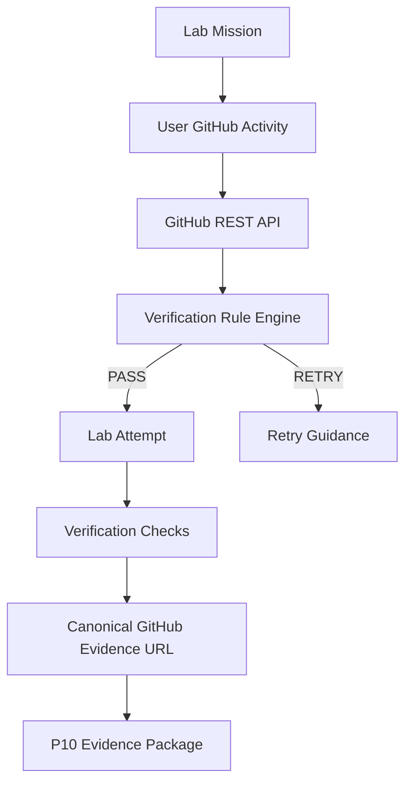

# 070 GitHub 연동 아키텍처 (GitHub Integration Architecture, GIA)

## 빠른 시작 (Quick Start, QS)

GitHub Lab은 사용자가 `완료` 버튼을 누르는 것으로 끝내지 않고 **실제 GitHub 객체를 읽기 전용 API로 검증**합니다.

## 목차 (Table of Contents, TOC)

1. 연동 범위
2. 인증 / Credential 경계
3. 검증 흐름
4. Verification Rule
5. Evidence
6. 권한·보안

## 1. 연동 범위

P9 GH-900 Vertical Slice는 다음을 검증합니다.

- Repository
- Branch
- Commit
- Issue
- Pull Request
- GitHub Actions Workflow / Run

현재 API 검증 Lab:

- 020 Remote Repository
- 030 Branch Workflow
- 040 GitHub Flow
- 080 Modern Development / Actions

다른 Lab은 Source of Truth의 수동 Verify 절차를 유지하고 이후 Rule을 확장합니다.

## 2. 인증 / Credential 경계

### Local P9

```text
Learner Fine-grained PAT
        ↓ HTTPS / localhost request
Server GET /user validation
        ↓
AES-256-GCM encryption
        ↓
github_connections
```

브라우저에는 저장 Token을 다시 반환하지 않습니다. `github_connections`는 authenticated Browser role에 직접 권한을 주지 않습니다.

권장 읽기 권한:

- Repository access: 학습용 Repository만 선택
- Contents: Read
- Issues: Read
- Pull requests: Read
- Actions: Read

### Stage 2 Cloud

GitHub App User Access Token을 우선합니다. `GitHubCredentialProvider` 경계에서 Credential 공급 방식만 교체하고 Lab Rule Engine은 유지합니다.

## 3. 검증 흐름



## 4. Verification Rule

P9 Rule version: `p9-gh900-v1`

예시:

```text
repository.exists == true
branch.name != repository.default_branch
commit belongs_to branch == true
pull_request.head == expected_branch
pull_request.base == default_branch
pull_request.body contains "Closes #<issue>"
actions.workflow_count >= 1
```

Required Check 중 하나라도 실패하면 `RETRY`, 모두 통과하면 `PASS`입니다. Workflow Run 존재 여부처럼 권장 증거는 non-required Check로 기록할 수 있습니다.

## 5. Evidence

`lab_attempts`:

- user id
- course / lab
- repository full name
- PASS / RETRY
- rule version
- verified_at

`lab_verification_checks`:

- check code
- object type / id
- PASS / FAIL
- 안전한 최소 metadata
- canonical GitHub URL

이 데이터는 P10 Evidence / Portfolio의 입력입니다.

## 6. 권한·보안

- P9는 Repository를 자동 수정하지 않습니다.
- Token plaintext를 DB나 Audit에 저장하지 않습니다.
- Token은 AES-256-GCM으로 암호화합니다.
- Encryption Key / Token / Supabase server credential은 server-only입니다.
- Browser는 `github_connections`를 직접 조회할 수 없습니다.
- Browser는 자신의 Lab Attempt / Check만 RLS로 조회 가능합니다.
- Attempt / Check 쓰기는 server-only입니다.
- Stage 2에서는 GitHub App 최소 권한을 사용합니다.
