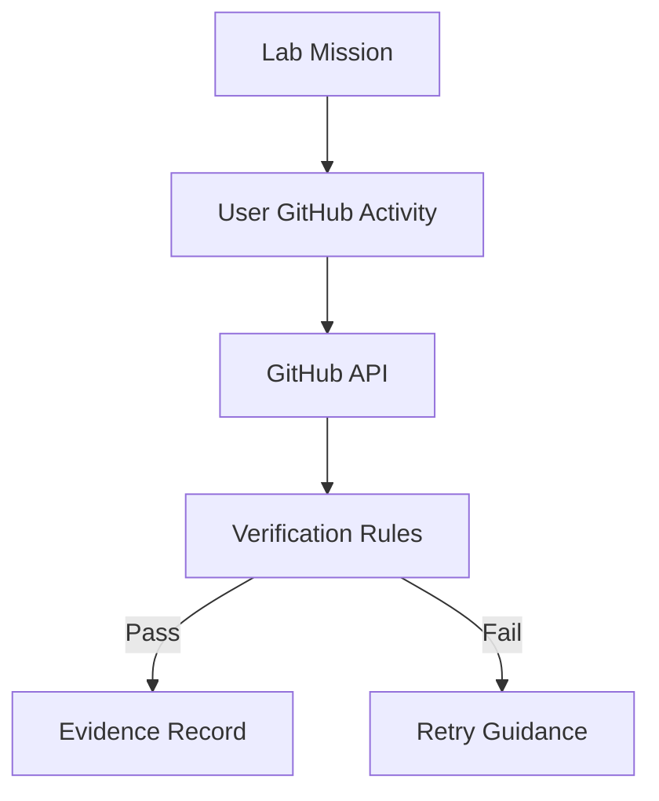

# 070 GitHub 연동 아키텍처 (GitHub Integration Architecture, GIA)

## 빠른 시작 (Quick Start, QS)

GitHub Lab은 사용자가 `완료` 버튼을 누르는 것으로 끝내지 않고 가능한 경우 실제 GitHub 객체를 API로 검증합니다.

## 목차 (Table of Contents, TOC)

1. 연동 범위
2. 검증 흐름
3. Verification Rule
4. Evidence
5. 권한·보안

## 1. 연동 범위

초기 GH-900에서는 다음 객체부터 검증합니다.

- Repository
- Branch
- Commit
- Issue
- Pull Request

후속 과정에서 다음으로 확장합니다.

- Actions / Workflow
- Release / Tag
- Security 기능
- Administration 정책

## 2. 검증 흐름



## 3. Verification Rule

Rule은 예를 들어 다음처럼 표현할 수 있습니다.

```text
repository.exists == true
branch.name == expected
pull_request.base == main
pull_request.state in [open, merged]
```

Rule 결과와 API 원본 메타데이터의 최소 증거를 함께 기록합니다.

## 4. Evidence

Evidence에는 최소 다음을 기록합니다.

- lab id
- user id
- repository full name
- verified object type/id
- verification rule version
- verified_at
- PASS/FAIL
- canonical GitHub URL

## 5. 권한·보안

- 최소 권한 OAuth/GitHub App scope를 사용합니다.
- Token을 브라우저 Local Storage에 장기 저장하지 않습니다.
- 사용자 private repository 접근은 명시적 권한과 필요성에 따라 별도 설계합니다.
- P9 구현 시 현재 GitHub OAuth/GitHub App 권한 모델을 다시 검증합니다.
