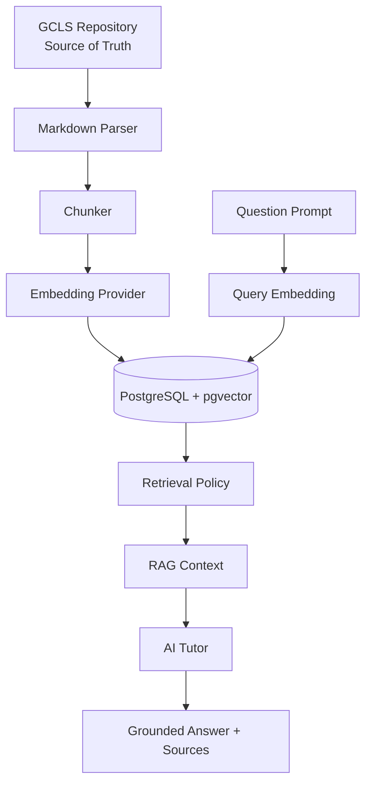

# P8 RAG — 검색 증강 생성 (Retrieval-Augmented Generation, RAG)

## 빠른 시작 (Quick Start, QS)

P8은 GCLS 메인 콘텐츠 저장소를 **Source of Truth**로 유지하면서, 재생성 가능한 검색 인덱스만 PostgreSQL/pgvector에 저장합니다.

```bash
npm run supabase:start
npm run supabase:reset
npm run dev
```

`.env.local`에는 최소 다음을 설정합니다.

```env
RAG_EMBEDDING_MODE=mock
RAG_EMBEDDING_DIMENSIONS=384
RAG_GROUNDING_MODE=required
RAG_INDEX_TOKEN=<local-secret>
GCLS_CONTENT_VERSION=<content-repository-commit-sha>
```

애플리케이션 실행 후 서버 전용 Index API를 호출합니다.

```bash
curl -X POST http://127.0.0.1:3000/api/rag/index \
  -H 'content-type: application/json' \
  -H 'x-rag-index-token: <local-secret>' \
  -d '{"courseSlug":"001-foundations"}'
```

상태 확인:

```bash
curl http://127.0.0.1:3000/api/rag/health
```

`status: ready`가 되면 AI Tutor가 저장소 근거를 검색해서 답변합니다.

## 목차 (Table of Contents, TOC)

1. 목표
2. 전체 Pipeline
3. Index 대상
4. 정답 보호 Retrieval Policy
5. Embedding Provider
6. Index Freshness / Profile
7. 데이터 모델
8. AI Tutor 연결
9. 보안 경계
10. 완료 기준

## 1. 목표

P7의 AI Tutor를 일반 모델 지식에만 의존하지 않고 **GCLS 저장소 근거 기반 Tutor**로 확장합니다.

```text
GCLS Content Repository
        ↓
Markdown Parser / Chunker
        ↓
Embedding Provider
        ↓
PostgreSQL + pgvector
        ↓
Retriever
        ↓
RAG Context + Source Metadata
        ↓
AI Tutor
```

DB의 RAG 데이터는 파생 데이터입니다. 원문 콘텐츠를 DB의 새로운 진실 원본으로 만들지 않습니다.

## 2. 전체 Pipeline



P8 GH-900 Vertical Slice는 `001-foundations`만 대상으로 합니다. 공통 RAG Engine을 먼저 완성한 뒤 이후 자격증으로 확장합니다.

## 3. Index 대상

### PRE_ANSWER — 제출 전 검색 가능

- `010-overview`
- `020-terms`
- `030-concepts`
- `040-official-docs`
- `050-guides`
- `060-labs`
- `140-resources`

### POST_ATTEMPT — 실제 Attempt 이후 추가 검색 가능

- `070-exercises`
- `090-final-review`
- `100-projects`

### Index 제외

- `080-question-bank`
- `110-mock-exams`
- `120-wrong-answers`
- `130-progress`
- `150-evidence`

따라서 문제은행의 정답/해설 문서를 Vector DB에 넣어 Hint 검색으로 우회 노출되는 경로를 만들지 않습니다.

## 4. 정답 보호 Retrieval Policy

| Tutor Stage | 선택지/정답을 생성 AI에 전달 | RAG Tier |
|---|---|---|
| Hint | No | PRE_ANSWER |
| Concept | No | PRE_ANSWER |
| Similar Example | No | PRE_ANSWER |
| Retry | 기존 Rule Engine | — |
| Explanation | 실제 Attempt 후 Yes | PRE_ANSWER + POST_ATTEMPT |

공개형 `/api/rag/search`도 항상 PRE_ANSWER만 검색합니다. Client가 Request Body를 바꿔 POST_ATTEMPT를 임의 요청할 수 없도록 Server가 정책을 고정합니다.

## 5. Embedding Provider

| Mode | Provider | Endpoint |
|---|---|---|
| `mock` | Deterministic Hash | CI / 개발 전용 |
| `local` | Ollama | `/api/embed` |
| `api` | OpenAI Embeddings | `/v1/embeddings` |

생성 AI에는 `hybrid`가 있지만 **Embedding에는 hybrid가 없습니다.** 서로 다른 모델의 Vector Space를 동일 Index에서 섞지 않기 위해 한 Index는 하나의 `embedding_profile`로 고정합니다.

P8 Vector dimension은 `384`로 고정합니다. Index와 Query 모두 같은 Provider / Model / Dimension을 사용해야 합니다.

## 6. Index Freshness / Profile

각 문서에는 다음을 저장합니다.

- `content_hash` — SHA-256
- `source_ref` — `GCLS_CONTENT_VERSION`
- `embedding_profile` — Provider + Model + Dimension

동작:

```text
문서 Hash 동일 + Profile 동일
        ↓
SKIP

문서 Hash 변경
        ↓
해당 문서만 Chunk / Embedding 재생성

Embedding Profile 변경
        ↓
전체 대상 문서 재색인

검색 Profile ≠ Index Profile
        ↓
RAG_PROFILE_MISMATCH → 차단

Content Version ≠ Index Source Ref
        ↓
RAG_INDEX_STALE → 차단
```

Production/CI에서는 `GCLS_CONTENT_VERSION`에 콘텐츠 저장소의 정확한 Commit SHA를 넣는 것을 권장합니다.

## 7. 데이터 모델

```text
rag_documents
  └─ rag_chunks (vector(384))

rag_index_runs

ai_interactions
  └─ ai_interaction_sources
```

- `rag_documents` / `rag_chunks`: 재생성 가능한 검색 Index
- `rag_index_runs`: Index 실행 상태와 Count Audit
- `ai_interactions`: Tutor 응답 + RAG Grounding 상태
- `ai_interaction_sources`: 실제 응답에 사용된 Source metadata Snapshot

Chunk가 재색인으로 교체되어도 과거 AI 상호작용의 Source path/title/similarity 기록은 유지됩니다.

## 8. AI Tutor 연결

```text
Question
   ↓
Attempt State 확인
   ↓
Allowed Source Tier 결정
   ↓
Query Embedding
   ↓
pgvector Cosine Retrieval
   ↓
[S1] [S2] ... Context
   ↓
AI Provider
   ↓
Answer + Source List
```

`RAG_GROUNDING_MODE`:

- `off`: RAG 사용 안 함
- `optional`: Index가 준비되지 않으면 기존 AI Tutor로 계속 진행
- `required`: Index 없음 / stale / profile mismatch / 검색 근거 없음이면 AI 생성 자체를 중단

P8 완료 상태에서는 실제 학습 환경에 `required`를 권장합니다.

## 9. 보안 경계

- Browser는 `rag_documents`, `rag_chunks`, `rag_index_runs`를 직접 읽거나 쓸 수 없습니다.
- Index API는 server-only `RAG_INDEX_TOKEN`을 요구합니다.
- Search API는 Supabase 로그인 Token이 필요합니다.
- 공개 Search API는 PRE_ANSWER Tier만 허용합니다.
- `ai_interaction_sources`는 RLS로 본인 기록만 SELECT 가능합니다.
- RAG는 채점에 사용되지 않습니다. 정답 판정은 기존 Source-backed Rule Engine이 담당합니다.
- API Key, Supabase secret/service-role, RAG Index token은 `NEXT_PUBLIC_*`로 노출하지 않습니다.

## 10. P8 완료 기준

- pgvector migration PASS
- GH-900 10개 허용 문서 Index PASS
- Hash 기반 Incremental Re-index PASS
- PRE_ANSWER / POST_ATTEMPT 정책 PASS
- Question Bank / Mock / Wrong Answer Index 제외 PASS
- Tutor Source Grounding PASS
- Attempt Gate 유지 PASS
- RAG Source Audit PASS
- Browser 직접 Index 접근 차단 PASS
- Cross-user RLS PASS
- Ollama Embedding contract PASS
- OpenAI Embedding contract PASS
- Embedding Profile mismatch Gate PASS
- P3~P7 Regression PASS
